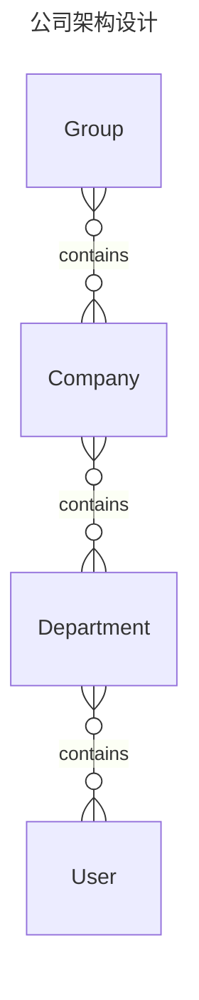
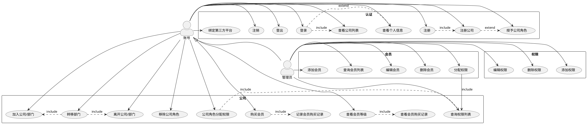

# 权限系统设计
## 多租户系统

```mermaid
---
title: 公司架构设计
---
erDiagram
    Group }o--o{ Company : contains
    Company }o--o{ Department : contains
    Department }o--o{ User : contains

```

```plantuml
@startuml
skinparam actorStyle awesome
skinparam packageStyle rectangle

actor 账号
rectangle 认证 {
    账号 -> (注册)
    账号 -> (登录)
    账号 -> (登出)
    账号 -> (注销)
    账号 -> (查看个人信息)
    账号 -> (绑定第三方平台)

    (登录) .> (查看公司列表):include
    (注册) .> (注册公司):include
   (注册公司)  .> (授予公司角色):extend
    (登录) .> (查看个人信息):extend
}
rectangle  公司 {
    账号 -> (加入公司/部门)
    账号 -> (注册公司)
    账号 ->  (转移部门)
    账号 ->  (离开公司/部门)
    账号 -> (授予公司角色)
    账号 -> (移除公司角色)
    账号 -> (公司角色分配权限)
    账号 -> (购买会员)
    账号 -> (查看公司列表)
    账号 -> (查看会员等级)

    (转移部门) .> (离开公司/部门)  : include
    (转移部门) .> (加入公司/部门)  : include
    (购买会员) .> (记录会员购买记录): include
    (查看会员等级) .> (查看会员购买记录): include
   (公司角色分配权限) .>  (查询权限列表) :include

}


actor 管理员
账号 <|-- 管理员
 rectangle 会员 {
     管理员 -> (添加会员)
     管理员 -> (删除会员)
     管理员 -> (编辑会员)
     管理员 -> (查询会员列表)
     管理员 -> (分配权限)
 }
 rectangle 权限{
    管理员 -> (添加权限)
    管理员 -> (删除权限)
    管理员 -> (编辑权限)
    管理员 -> (查询权限列表)
    (分配权限) --> (查询权限列表) : include
 
 }

@enduml
```

## 数据库表结构

[表设计文件](./sql/security.md)

[表数据初始化文件](./sql/security-data.md)

