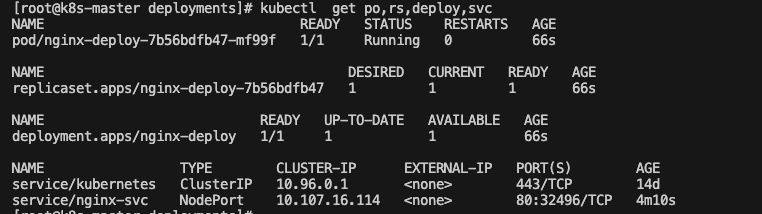

# 学习前提

## 服务器安装配置

### 1. 安装centos7

[centos7 下载链接](https://mirrors.huaweicloud.com/centos-vault/7.9.2009/isos/x86_64/CentOS-7-x86_64-Everything-2009.iso)

### 2. 配置yum环境

1. 备份环境

```shell
cp -a /etc/yum.repos.d/CentOS-Base.repo /etc/yum.repos.d/CentOS-Base.repo.bak
```

2. 使用华为云镜像地址

```shell
wget -O /etc/yum.repos.d/CentOS-Base.repo https://mirrors.huaweicloud.com/repository/conf/CentOS-7-anon.repo
```

3. 清除原有缓存

```shell
yum clean all
```

4. 刷新缓存

```shell
yum makecache
```

### 3. 检查ssh环境是否安装

```shell
rpm -qa|grep -E "openssh"
```

> 出现以下输出代表则安装

* openssh-7.4p1-11.el7.x86_64
* openssh-server-7.4p1-11.el7.x86_64
* openssh-clients-7.4p1-11.el7.x86_64

> 否则安装

```shell
yum install openssh-server -y
```

1. 查看ssh配置

```shell
vim /etc/ssh/sshd_config
```

2. 开放防火墙

```shell
sudo firewall-cmd --zone=public --add-port=22/tcp --permanent  
sudo service firewalld restart  
```

3. 永久关闭防火墙

```shell
systemctl disable firewalld 
```

4. 公钥写入服务器

```shell
"ssh-rsa AAAAB3NzaC1yc2EAAAADAQABAAABgQDHBh2mWGRseRdiyf9abEdyyL8TSP8qeri40NcA7jMXKhKeqPVbOJaScYZJa2MxK9Y5NamZUrpIxQqtZqHCOWohRxdfnxpj4F+OzGTDKCMU7P1vkvygJNYFhB/zcrGf+wH6yXq6PEbbgWx5a9ITVRvPRrZ6IVm6q4Ix+3uxzf71DkufRJ+6yjFn/PhD2YkhM5pH6KtS934H7bJfdDl+Tv/2QY3Xk2c2c/v34YWBHgMPtSjW4EFuF9FqFVcpyrIW+5X6i4gAYlSPNK6kEM4OCUoYcEhF7AvxHWQsxBhN7281QHvGhPJJCQtBSwyzin1zit8JO2ks1VRtXzSBGCSWbeaBoELCfbJ0xNCsrdEZjjB/kw98wSt+9jQs4v7wBYcAVUf891KBk88dtOq+7Ry1db8tj+vm/D2CWtVM9gpJnsJiyRyjBb5dPMtBDGF+nUlFIRTDxuClPNJkn7PjIVnE99o0G3g1YDdL+y2fRILGxWw7cw+YOl6CNVAwU8aiOq+FlJM= enigma@EnigmadeMac-Pro.local" >> /root/.ssh/authorized_keys
```

5. 重启ssh服务

```shell
systemctl restart sshd.service
```

6. 使用桥接模式固定网络
7. 编辑配置文件

```shell
vim /etc/sysconfig/network-scripts/ifcfg-ens33
```

```shell
# 更新
BOOTPROTO="none" 
# 编辑
NM_CONTROLLED="yes"
IPADDR="192.168.3.15"  # 这里就是你设置的固定IP
NETMASK="255.255.255.0" # 上图中IPv4 子网掩码
GATEWAY="192.168.3.1"   # 上图中IPv4 默认网关
DNS1="192.168.3.1"  
```

## 安装k8s

### 1. 安装前配置

1. 设置主机名

```shell
hostnamectl set-hostname <hostname>
```

2. 配置dns

```shell
cat >> /etc/hosts << EOF
192.168.3.15 k8s-master
192.168.3.16 k8s-node-1
192.168.3.17 k8s-node-2
EOF
```

3. 将桥接的IPv4流量传递到iptables的链

```shell
cat > /etc/sysctl.d/k8s.conf << EOF
net.bridge.bridge-nf-call-ip6tables = 1
net.bridge.bridge-nf-call-iptables = 1
EOF
```

4. 使得配置生效

```shell
sysctl --system 
```

5. 时间同步

```shell
yum install ntpdate -y # 安装utpdate工具
ntpdate time.windows.com # 设置系统时间与网络时间同步
hwclock --systohc # 将系统时间写入硬件时间
timedatectl set-timezone Asia/Shanghai # 设置系统时区为上海
```

6. 禁用swap

```shell
swapoff -a  # 临时
sed -ri 's/.*swap.*/#&/' /etc/fstab    # 永久
```

## 安装docker

1. 下载docker依赖工具

```shell
yum install -y yum-utils \
           device-mapper-persistent-data \
           lvm2 --skip-broken
```

2. 配置docker镜像源

```shell
wget -O /etc/yum.repos.d/docker-ce.repo https://mirrors.huaweicloud.com/docker-ce/linux/centos/docker-ce.repo
```

3. 替换软件仓库地址

```shell
sudo sed -i 's+download.docker.com+mirrors.huaweicloud.com/docker-ce+' /etc/yum.repos.d/docker-ce.repo
```

4. 更新索引文件

```shell
sudo yum makecache fast
```

5. 安装docker

```shell
sudo yum install -y docker-ce 
```

6. 添加开机自启动

```shell
systemctl enable docker
```

## 部署k8s集群

### 1. 配置安装源

```shell
cp /etc/yum.repos.d/kubernetes.repo /etc/yum.repos.d/kubernetes.repo.bak
```

### 2. 写入镜像源

```shell
cat > /etc/yum.repos.d/kubernetes.repo << EOF
[kubernetes]
name=Kubernetes
baseurl=https://mirrors.aliyun.com/kubernetes/yum/repos/kubernetes-el7-x86_64
enabled=1
gpgcheck=0
repo_gpgcheck=0

gpgkey=https://mirrors.aliyun.com/kubernetes/yum/doc/yum-key.gpg https://mirrors.aliyun.com/kubernetes/yum/doc/rpm-package-key.gpg
EOF
```

### 3. 安装 kubeadm、kubelet、kubectl

```shell
yum install -y kubelet-1.23.6 kubeadm-1.23.6 kubectl-1.23.6
```

### 4. 配置开机自启动

```shell
systemctl enable kubelet
```

### 5. 启动master的k8s {#启动master的k8s}

```shell
kubeadm init \
      --apiserver-advertise-address=192.168.3.17 \
      --image-repository registry.aliyuncs.com/google_containers \
      --kubernetes-version v1.23.6 \
      --service-cidr=10.96.0.0/12 \
      --pod-network-cidr=10.244.0.0/16
```

#### 1. 查看启动报错日志

```shell
journalctl -xefu kubelet
```

> 目前已知错误

##### 1. docker 驱动不可用

```log
Jan 19 01:09:46 k8s-master kubelet[4459]: E0119 01:09:46.180661    4459 server.go:302] "Failed to run kubelet" err="failed to run Kubelet: misconfiguration: kubelet cgroup driver: \"systemd\" is different from docker cgroup driver: \"cgroupfs\""
```

> 解决方案就是将驱动改掉 在 <code>/etc/docker/daemon.json</code> 中加入属性 **exec-opt**

```json
{
  ...
  "registry-mirrors": [
    "https://registry.cn-hangzhou.aliyuncs.com"
  ],
  "exec-opts": [
    "native.cgroupdriver=systemd"
  ]
  ...
}
```

查看docker驱动

```shell
   docker info|grep Driver
```

重置k8s

```shell
kubeadm reset
```

### 6. 启动成功

```shell
kubeadm join 192.168.3.15:6443 --token i96qyt.98nr3nw9u6bcyjb6 \
        --discovery-token-ca-cert-hash sha256:e7692c714af85261f62e27936ea51ad23666adb9a0616629d8f326603aead278 

kubeadm join 192.168.3.16:6443 --token lfnqoy.rrtcx5ohfgox0v2p \
        --discovery-token-ca-cert-hash sha256:9b3a2d1d37c13293266ddfbef4ac41d2027c38bd9ddf2dc52ff4d085dcdea1b8 

kubeadm join 192.168.3.17:6443 --token lzezel.pextlnbvqj1lk82c \
        --discovery-token-ca-cert-hash sha256:71a573c3959ad1fe8adeae4b8898c290f3d86f2973d144c43f8df05fe3da512c 
```

#### 1.随后执行启动成功建议

```shell
  mkdir -p $HOME/.kube
  sudo cp -i /etc/kubernetes/admin.conf $HOME/.kube/config
  sudo chown $(id -u):$(id -g) $HOME/.kube/config
```

### 7. master加入节点

#### 1. token 过期创建token

```shell
kubeadm token create
```

#### 2. 没有过期就查看token

```shell
kubeadm token list
```

#### 3. 生成token-hash

```shell
openssl x509 -pubkey -in /etc/kubernetes/pki/ca.crt | openssl rsa -pubin -outform der 2>/dev/null | openssl dgst -sha256 -hex | sed 's/^.* //'
```

#### 4. 重置一下node节点信息

> tip: 节点无法加入master时使用

```shell
kubeadm reset
```

#### 5. 集群加入节点

```shell
kubeadm join 192.168.3.15:6443 --token i96qyt.98nr3nw9u6bcyjb6    --discovery-token-ca-cert-hash sha256:e7692c714af85261f62e27936ea51ad23666adb9a0616629d8f326603aead278
```

### 8. 配置网络

#### 1. 下载calico网络配置 [calico.yml](./file/calico.yml)

```shell
 curl https://docs.projectcalico.org/manifests/calico.yaml -O
```

#### 2. 修改网络配置 <code> CALICO_IPV4POOL_CIDR </code> [网络配置](#启动master的k8s) 与此处的

 <code>pod-network-cidr </code>  一致

#### 3. 下载文件所需镜像

```shell
grep image calico.yaml 
```

#### 4. 如有需要可替换docker 下载地址切换为 阿里云私服 地址

       docker.io/calico -> registry.cn-hangzhou.aliyuncs.com/mhr

#### 5. 创建私钥

```shell
kubectl create secret -n default docker-registry my-aliyun --docker-server=registry.cn-hangzhou.aliyuncs.com --docker-username=马海荣 --docker-password=mmmm0827
```

#### 6. 上传到服务器

```shell
scp -p calico.yaml root@192.168.3.15:/opt/k8s/calico.yaml
```

#### 7. 构建网络

```shell
kubectl apply -f calico.yaml
```

#### 8. 查看网络信息

```shell
   kubectl get po -n kube-system
```

#### 9. 结果如下

| NAME                                   | READY | STATUS                | RESTARTS    | AGE   |
|:--------------------------------------:|:-----:|:---------------------:|:-----------:|:-----:|
| calico-kube-controllers-744c7d9b-bbfxc | 1/1   | Running               | 0           | 106s  |
| calico-node-6l977                      | 0/1   | Init:ErrImagePul      | 0           | 106s  |
| calico-node-76l87                      | 0/1   | Init:ImagePullBackOff | 0           | 106s  |
| calico-node-zpsrk                      | 1/1   | Running               | 0           | 106s  |
| coredns-6d8c4cb4d-brxjx                | 1/1   | Running               | 0           | 2d21h |
| coredns-6d8c4cb4d-pchnj                | 1/1   | Running               | 0           | 2d21h |
| etcd-k8s-master                        | 1/1   | Running               | 2(2d6h ago) | 2d21h |
| kube-apiserver-k8s-master              | 1/1   | Running               | 2(2d6h ago) | 2d21h |
| kube-controller-manager-k8s-master     | 1/1   | Running               | 2(2d6h ago) | 2d21h |
| kube-proxy-jcgmm                       | 1/1   | Running               | 1(2d6h ago) | 2d21h |
| kube-proxy-jglwq                       | 1/1   | Running               | 0           | 2d6h  |
| kube-proxy-t2jqx                       | 1/1   | Running               | 0           | 2d6h  |
| kube-scheduler-k8s-master              | 1/1   | Running               | 2(2d6h ago) | 2d21h |

1. 节点出现问题排查命令

```shell
kubectl  describe po calico-node-6l977 -n kube-system
```

### 9. 测试k8s集群

#### 1. 创建nginx

```yaml
apiVersion: apps/v1 # deployment api 版本
kind: Deployment # 资源类型为 deployment
metadata: # 元信息
  labels: # 标签
    app: nginx-deploy # 具体的 key: value 配置形式
  name: nginx-deploy # deployment 的名字
  namespace: default # 所在的命名空间
spec:
  replicas: 1 # 期望副本数
  revisionHistoryLimit: 10 # 进行滚动更新后，保留的历史版本数
  selector: # 选择器，用于找到匹配的 RS
    matchLabels: # 按照标签匹配
      app: nginx-deploy # 匹配的标签key/value
  strategy: # 更新策略
    rollingUpdate: # 滚动更新配置
      maxSurge: 25% # 进行滚动更新时，更新的个数最多可以超过期望副本数的个数/比例
      maxUnavailable: 25% # 进行滚动更新时，最大不可用比例更新比例，表示在所有副本数中，最多可以有多少个不更新成功
    type: RollingUpdate # 更新类型，采用滚动更新
  template: # pod 模板
    metadata: # pod 的元信息
      labels: # pod 的标签
        app: nginx-deploy
    spec: # pod 期望信息
      imagePullSecrets: #设置镜像的下载秘钥(例如使用私库下载镜像时,访问私库需要秘钥,就在该位置设置)
        - name: my-aliyun #设置指定秘钥名
      containers: # pod 的容器
      - image: registry.cn-hangzhou.aliyuncs.com/mhr/nginx:latest # 镜像
        imagePullPolicy: IfNotPresent # 拉取策略
        name: nginx # 容器名称
        resources:
          limits:
            cpu: 200m
            memory: 128Mi
          requests:
            cpu: 100m
            memory: 128Mi
      restartPolicy: Always # 重启策略
      terminationGracePeriodSeconds: 30 # 删除操作最多宽限多长时间

```

#### 2. 使用service暴露端口

```yaml
apiVersion: v1
kind: Service
metadata:
  name: nginx-svc
  labels:
    app: nginx
spec:
  selector:
    app: nginx-deploy
  ports:
  - port: 80
    targetPort: 80
    name: web
  type: NodePort

```

#### 3. 查看信息

```shell
kubectl get pod,svckubectl  get po,rs,deploy,svc

```

#### 4. 结果



>  访问 http://192.168.3.15/16/17:32496/ 即可实现访问

### 10. 在任意节点使用kubectl

1. 将 master 节点中 /etc/kubernetes/admin.conf 拷贝到需要运行的服务器的 /etc/kubernetes 目录中
   
   ```shell
    scp /etc/kubernetes/admin.conf root@k8s-node-1:/etc/kubernetes
   ```

2. 在对应的服务器上配置环境变量
   
   ```shell
      echo "export KUBECONFIG=/etc/kubernetes/admin.conf" >> ~/.bash_profile
      source ~/.bash_profile
   ```

### k8s 常用命令

1. 查看节点

```shell
kubectl get nodes/no
```

2. 查看组件状态

```shell
kubectl get componentstatus/cs
```

# K8S核心概念

## 1.  服务的分类

### 1. 无状态

> 优点：对客户端透明，无依赖关系，可以高效实现扩容、迁移

> 缺点：不能存储数据，需要额外的数据服务支撑

### 2. 有状态

> 优点：可以独立存储数据，实现数据管理

> 缺点：集群环境下需要实现主从、数据同步、备份、水平扩容复杂


## 2. 资源和对象

### 1. 资源的分类

#### 1. 元数据型

##### Horizontal Pod Autoscaler（HPA）

Pod 自动扩容：可以根据 CPU 使用率或自定义指标（metrics）自动对 Pod 进行扩/缩容。

- 控制管理器每隔30s（可以通过–horizontal-pod-autoscaler-sync-period修改）查询metrics的资源使用情况
- 支持三种metrics类型
  - 预定义metrics（比如Pod的CPU）以利用率的方式计算
  - 自定义的Pod metrics，以原始值（raw value）的方式计算
  - 自定义的object metrics
- 支持两种metrics查询方式：Heapster和自定义的REST API
- 支持多metrics

##### PodTemplate

Pod Template 是关于 Pod 的定义，但是被包含在其他的 Kubernetes 对象中（例如 Deployment、StatefulSet、DaemonSet 等控制器）。控制器通过 Pod Template 信息来创建 Pod。

##### LimitRange

可以对集群内 Request 和 Limits 的配置做一个全局的统一的限制，相当于批量设置了某一个范围内（某个命名空间）的 Pod 的资源使用限制。

#### 2. 集群级

##### Namespace

Kubernetes 支持多个虚拟集群，它们底层依赖于同一个物理集群，这些虚拟集群被称为命名空间。  

作用是用于实现多团队/环境的资源隔离。  

命名空间 namespace 是 k8s 集群级别的资源，可以给不同的用户、租户、环境或项目创建对应的命名空间。  

默认 namespace：

- kube-system 主要用于运行系统级资源，存放 k8s 自身的组件
- kube-public 此命名空间是自动创建的，并且可供所有用户（包括未经过身份验证的用户）读取。此命名空间主要用于集群使用，关联的一些资源在集群中是可见的并且可以公开读取。此命名空间的公共方面知识一个约定，但不是非要这么要求。
- default 未指定名称空间的资源就是 default，即你在创建pod 时如果没有指定 namespace，则会默认使用 default

##### Node

不像其他的资源（如 Pod 和 Namespace），Node 本质上不是Kubernetes 来创建的，Kubernetes 只是管理 Node 上的资源。虽然可以通过 Manifest 创建一个Node对象（如下 json 所示），但 Kubernetes 也只是去检查是否真的是有这么一个 Node，如果检查失败，也不会往上调度 Pod。

##### ClusterRole

ClusterRole 是一组权限的集合，但与 Role 不同的是，ClusterRole 可以在包括所有 Namespace 和集群级别的资源或非资源类型进行鉴权。

##### ClusterRoleBinding

ClusterRoleBinding：将 Subject 绑定到 ClusterRole，ClusterRoleBinding 将使规则在所有命名空间中生效。

#### 3. 命名空间级

##### 工作负载型

###### Pod

**副本（replicas）**

先引入“副本”的概念——一个 Pod 可以被复制成多份，每一份可被称之为一个“副本”，这些“副本”除了一些描述性的信息（Pod 的名字、uid 等）不一样以外，其它信息都是一样的，譬如 Pod 内部的容器、容器数量、容器里面运行的应用等的这些信息都是一样的，这些副本提供同样的功能。  

Pod 的 ***“控制器”*** 通常包含一个名为 “replicas” 的属性。“replicas”属性则指定了特定 Pod 的副本的数量，当当前集群中该 Pod 的数量与该属性指定的值不一致时，k8s 会采取一些策略去使得当前状态满足配置的要求。

**控制器**

**适用无状态服务**

- ReplicationController（RC）
  
  > Replication Controller 简称 RC，RC 是 Kubernetes 系统中的核心概念之一，简单来说，RC 可以保证在任意时间运行 Pod 的副本数量，能够保证 Pod 总是可用的。如果实际 Pod 数量比指定的多那就结束掉多余的，如果实际数量比指定的少就新启动一些Pod，当 Pod 失败、被删除或者挂掉后，RC 都会去自动创建新的 Pod 来保证副本数量，所以即使只有一个 Pod，我们也应该使用 RC 来管理我们的 Pod。可以说，通过 ReplicationController，Kubernetes 实现了 Pod 的高可用性。

- ReplicaSet（RS）
  
  > RC （ReplicationController ）主要的作用就是用来确保容器应用的副本数始终保持在用户定义的副本数 。即如果有容器异常退出，会自动创建新的 Pod 来替代；而如果异常多出来的容器也会自动回收（已经成为过去时），在 v1.11 版本废弃。  
  > 
  > ​**Kubernetes 官方建议使用 RS（ReplicaSet ） 替代 RC （ReplicationController ） 进行部署，RS 跟 RC 没有本质的不同，只是名字不一样，并且 RS 支持集合式的 selector。**

Label 和 Selector

> label （标签）是附加到 Kubernetes 对象（比如 Pods）上的键值对，用于区分对象（比如Pod、Service）。 label 旨在用于指定对用户有意义且相关的对象的标识属性，但不直接对核心系统有语义含义。 label 可以用于组织和选择对象的子集。label 可以在创建时附加到对象，随后可以随时添加和修改。可以像 namespace 一样，使用 label 来获取某类对象，但 label 可以与 selector 一起配合使用，用表达式对条件加以限制，实现更精确、更灵活的资源查找。  

label 与 selector 配合，可以实现对象的“关联”，“Pod 控制器” 与 Pod 是相关联的 —— “Pod 控制器”依赖于 Pod，可以给 Pod 设置 label，然后给“控制器”设置对应的 selector，这就实现了对象的关联。

- Deployment

> Deployment 为 Pod 和 Replica Set 提供声明式更新。  
> 
> 你只需要在 Deployment 中描述你想要的目标状态是什么，Deployment controller 就会帮你将 Pod 和 Replica Set 的实际状态改变到你的目标状态。你可以定义一个全新的 Deployment，也可以创建一个新的替换旧的 Deployment。

1. 创建 Replica Set / Pod

2. 滚动升级/回滚

3. 平滑扩容和缩容

4. 暂停与恢复 Deployment


**适用有状态服务**

StatefulSet

1. 主要特点
   
   - 稳定的持久化存储
     
     > 即 Pod 重新调度后还是能访问到相同的持久化数据，基于 PVC 来实现
   
   - 稳定的网络标志
     
     > 稳定的网络标志，即 Pod 重新调度后其 PodName 和 HostName 不变，基于 Headless Service（即没有 Cluster IP 的 Service）来实现
   
   - 有序部署，有序扩展
     
     > 有序部署，有序扩展，即 Pod 是有顺序的，在部署或者扩展的时候要依据定义的顺序依次依次进行（即从 0到 N-1，在下一个Pod 运行之前所有之前的 Pod 必须都是 Running 和 Ready 状态），基于 init containers 来实现
   
   - 有序收缩，有序删除
     
     > 有序收缩，有序删除（即从 N-1 到 0）

2. 组成
   
   - Headless Service
     
     > 用于定义网络标志（DNS domain）  
     > 
     > Domain Name Server：域名服务  
     > 将域名与 ip 绑定映射关系  
     > 
     > 服务名 => 访问路径（域名） => ip
   
   - volumeClaimTemplate
     
     > 用于创建 PersistentVolumes

3. 注意事项
   
   - kubernetes v1.5 版本以上才支持
   
   - 所有Pod的Volume必须使用PersistentVolume或者是管理员事先创建好
   
   - 为了保证数据安全，删除StatefulSet时不会删除Volume
   
   - StatefulSet 需要一个 Headless Service 来定义 DNS domain，需要在 StatefulSet 之前创建好


**守护进程**

DaemonSet

> DaemonSet 保证在每个 Node 上都运行一个容器副本，常用来部署一些集群的日志、监控或者其他系统管理应用。典型的应用包括：
> 
> - 日志收集，比如 fluentd，logstash 等
> - 系统监控，比如 Prometheus Node Exporter，collectd，New Relic agent，Ganglia gmond 等
> - 系统程序，比如 kube-proxy, kube-dns, glusterd, ceph 等

**任务/定时任务**

Job

> 一次性任务，运行完成后Pod销毁，不再重新启动新容器。

CronJob

> CronJob 是在 Job 基础上加上了定时功能。

###### 服务发现

###### 存储

###### 特殊类型配置

###### 其他

# K8S 实践

## 安装nfs

### 1. 安装 nfs

```shell
yum install nfs-utils -y
```

### 2. 启动 nfs

```shell
systemctl start nfs-server
```


### 3. 查看 nfs 版本

```shell
cat /proc/fs/nfsd/versions
```


### 4. 创建共享目录

```shell
mkdir -p /data/nfs  
cd /data/nfs  
mkdir rw  
mkdir ro
```

### 5. 设置共享目录 export

```shell
vim /etc/exports  
/data/nfs/rw 192.168.3.0/24(rw,sync,no_subtree_check,no_root_squash)  
/data/nfs/ro 192.168.3.0/24(ro,sync,no_subtree_check,no_root_squash)
```

### 6.重新加载

```shell
exportfs -f  
systemctl reload nfs-server
```

### 7.到其他测试节点安装 nfs-utils 并加载测试

```shell
mkdir -p /mnt/nfs/rw  
mount -t nfs 192.168.3.16:/data/nfs/rw /mnt/nfs/rw

mkdir -p /mnt/nfs/ro 
mount -t nfs 192.168.3.16:/data/nfs/ro /mnt/nfs/ro
```


## NFS 挂载

```yaml
apiVersion: v1
kind: Pod
metadata:
  name: test-pd
spec:
  containers:
  - image: nginx
    name: test-container
    volumeMounts:
    - mountPath: /my-nfs-data
      name: test-volume
  volumes:
  - name: test-volume
    nfs:
      server: 192.168.3.16 # 网络存储服务地址
      path: /data/nfs/rw/www/mhr # 网络存储路径
      readOnly: false # 是否只读

```


